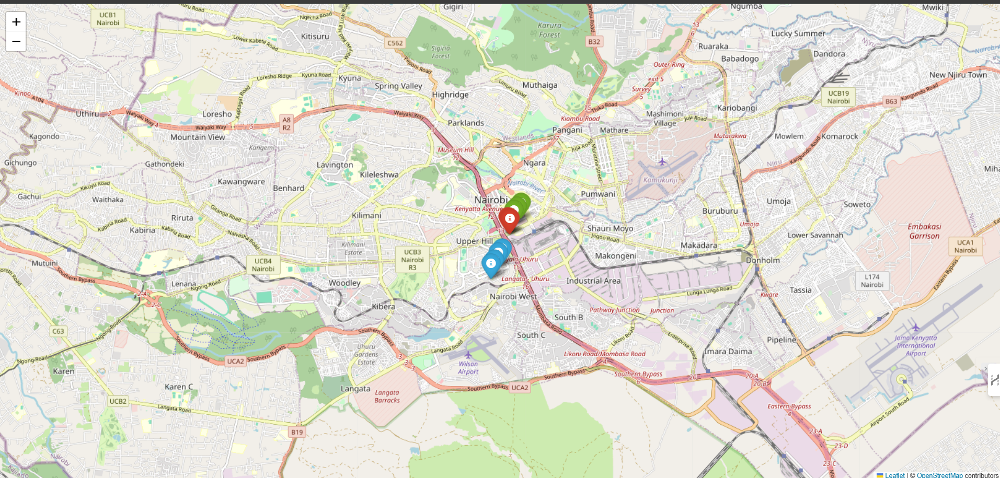

# smart-public-transport-optimizer-SDG11
# 🚍 Smart Public Transport Optimizer for Sustainable Cities (SDG 11)

## 🌍 SDG Focus
**SDG 11** – Make cities inclusive, safe, resilient, and sustainable.

## 🚨 Problem
Many cities suffer from poorly placed bus stops and inefficient routing. This leads to long travel times, wasted fuel, and negative environmental impact.

## ✅ Solution
We use **KMeans clustering** and basic AI techniques to:
- Group nearby bus stops for better planning.
- Suggest optimized routes within clusters.
- Visualize results on an interactive map using **Folium**.

## 🧠 AI & Engineering Concepts
- Clustering with **Scikit-learn**
- Route optimization using **Nearest Neighbor**
- Modular, testable Python code
- Folium-based map generation
- Optional Streamlit UI

## 🛠 Tools & Libraries
- Python, Jupyter Notebook
- `pandas`, `numpy`
- `scikit-learn`, `folium`
- `matplotlib` (optional)
- `streamlit` (optional for UI)

## 📁 Project Structure
smart-public-transport-optimizer-SDG11/
├── data/ # Bus stop location dataset (CSV)
├── notebooks/ # Jupyter Notebooks (clustering, maps)
├── tests/ # Unit tests for clustering logic
├── output/ # Generated Folium maps
├── report/ # Final project report (PDF)
├── README.md
├── requirements.txt
└── .gitignore

yaml

---

## 🔍 How It Works

1. **Load dataset** – Latitude/longitude of public stops
2. **Cluster stops** – Group based on proximity using `KMeans`
3. **Optimize route** – Simple path planning within clusters
4. **Visualize** – Interactive map using `Folium`

---

## 🌱 Ethical & Sustainability Considerations

| Aspect | Action |
|--------|--------|
| ⚖️ Bias | Audit clustering to ensure no region is underserved |
| 🌍 Sustainability | Reduced route time = lower emissions |
| 💡 Accessibility | Runs on Google Colab, no heavy setup |
| 🔓 Open Data | Uses synthetic or public transport datasets |

---

## 🚀 Getting Started

### 🔧 Setup

1. Clone the repo  
   ```bash
   git clone https://github.com/YOUR_USERNAME/smart-public-transport-optimizer-SDG11.git
   cd smart-public-transport-optimizer-SDG11
Install dependencies

bash
Copy
Edit
pip install -r requirements.txt
Run notebook in Jupyter or Google Colab

🧪 Example Result
✅ Bus stops are clustered visually

✅ Routes are simplified and optimized

✅ Map exported as clustered_map.html

## 📍 Preview

Here's a sample of the clustered bus stops map:




🙋‍♂️ Author
Evans Kyalo Muendo
Student | Software Engineer | AI Explorer

